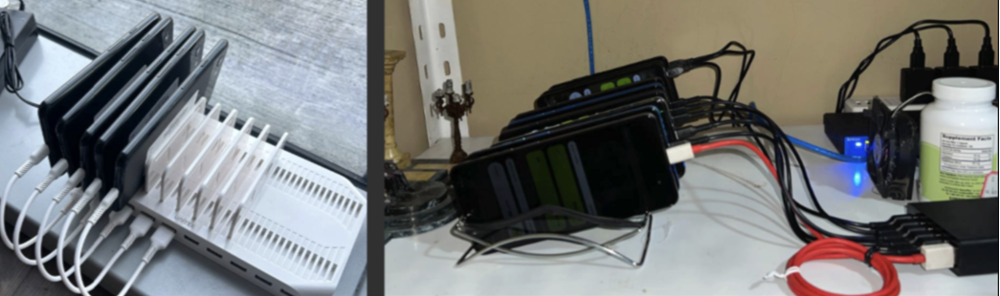

# Omni Castles on Fhenix

This project is built on the foundation of work that began at **ETH Denver** and is a continuation of previous efforts. The original concept was explored in the [Stealth Command project](https://github.com/Cloakworks-collective/stealth_command), and **Omni Castles** expands upon it with several significant technical improvements. It is developed using the [Fhenix Hardhat Example](https://github.com/fhenixprotocol/fhenix-hardhat-example).

## Improvements Contribution of This Project

Omni Castles addresses two main challenges that I ran into while doing game development on Fhenix: the lack of oracles and decentralized keepers. By integrating Acurast, the game introduces both functionalities to the Fhenix ecosystem.

Acurast provides a decentralized, trustless compute execution layer, enabling off-chain workers (processors) to fetch, sign, and submit data on-chain in a confidential and trust-minimized way. For the proof of concept, a Node.js script running on an Acurast processor fetches weather data from the OpenWeather API. This weather data is signed by a designated "weatherman" and forwarded to the game’s smart contract, ensuring authenticity without added trust overhead.

The weather data updates the in-game conditions to one of the following:

```rust
    const CLEAR: u8 = 0;
    const CLOUDS: u8 = 1;
    const SNOW: u8 = 2;
    const RAIN: u8 = 3;
    const DRIZZLE: u8 = 4;
    const THUNDERSTORM: u8 = 5;
```
Each weather condition affects the effectiveness of the units, adding a layer of strategy to the game. 

Moreover, we also use a second script to call `tick_tock()` function of the module to update player states every turn. This is a proof of concept use of Acurast processors as ** decentralized keepers**. This function is not gated (anyone call this), however there is an internal check that only affects the game state if it is called after 1 hr has passed.

Note: You can find out more on Acurast's trust minimized processing [here](https://docs.acurast.com/acurast-protocol/architecture/end-to-end/)

Acurast processor clusters are highly decentralized and permissionless, allowing anyone to join and contribute, making the network more resilient and distributed. The picture below showcases various processor clusters. The one on the left represents our cluster, where our proof-of-concept scripts are currently running. In production, we plan to deploy to a randomly selected processor within the Acurast ecosystem (ones that we do not own), with multiple redundancies to further minimize trust assumptions and enhance reliability.



Omni Castles introduces **Acurast Oracles** to the **Fhenix** ecosystem, marking a major advancement for the platform. Previously, Fhenix lacked oracle support, limiting its ability to access off-chain data. By integrating Acurast, Fhenix now has access to external, real-world data, which enables decentralized applications (dApps) to operate with previously unavailable off-chain information. This opens up new possibilities for dApps within the Fhenix ecosystem.

## Game Overview

In **Omni Castles**, players compete to capture and defend a single castle deployed on the Fhenix platform. The objective is to take control of the castle and maintain that position for as long as possible, as there can only be **one king** at any time. The game follows a **king of the hill** format, where players launch attacks to dethrone the reigning king and seize control of the castle.

### Public Attacks, Hidden Defense

A key feature of the game is the transparency of attacks. All **attacks on the castle are public**, meaning the composition of the attacking army is visible to all players. However, the castle's **defense remains hidden**, with its defensive forces encrypted and stored on-chain as hashes. This ensures that only the current king knows the true composition of the defense, adding an element of secrecy.

### On-Chain Battle Computation

When an attack is launched, battle computations are performed entirely on-chain using encrypted data. This is made possible by the **Homomorphic Encryption over the Torus (TFHE)** library, which allows battle outcomes to be calculated without revealing the composition of the castle's defense. This ensures that defense details remain confidential, while providing transparency in the battle results.

### Strategic Information Leaks

A unique aspect of the game is the **controlled leak of information**. Depending on the performance of the defending army—whether it holds the castle or loses it—limited insights into the defense are revealed. This adds a layer of strategic depth, as players can analyze past battles to predict how the castle might be defended in future attacks.

### Realtime Oracle Data - Weather

Both attacking and defending armies undergo **on-chain verification** to ensure adherence to the game’s rules. This verification process prevents cheating, ensuring that all players follow the established guidelines and that battles are conducted fairly.

## Key Game Features

- **Single Castle**: One castle, one king—players compete to capture and hold the castle in a king of the hill format.
- **Public Attacks**: All attacks on the castle are visible to all players, making offensive strategies transparent.
- **Hidden Defenses**: The castle’s defenses are encrypted and stored on-chain, remaining secret until a breach occurs.
- **Homomorphic Encryption**: The TFHE library is used to maintain the confidentiality of the castle’s defense while performing battle computations on-chain.
- **Information Leaks**: Based on battle outcomes, limited information about the defense is revealed, adding strategic depth.
- **On-Chain Verification**: Both attacking and defending armies are verified on-chain to ensure fair play and rule compliance, maintaining transparency and integrity.
